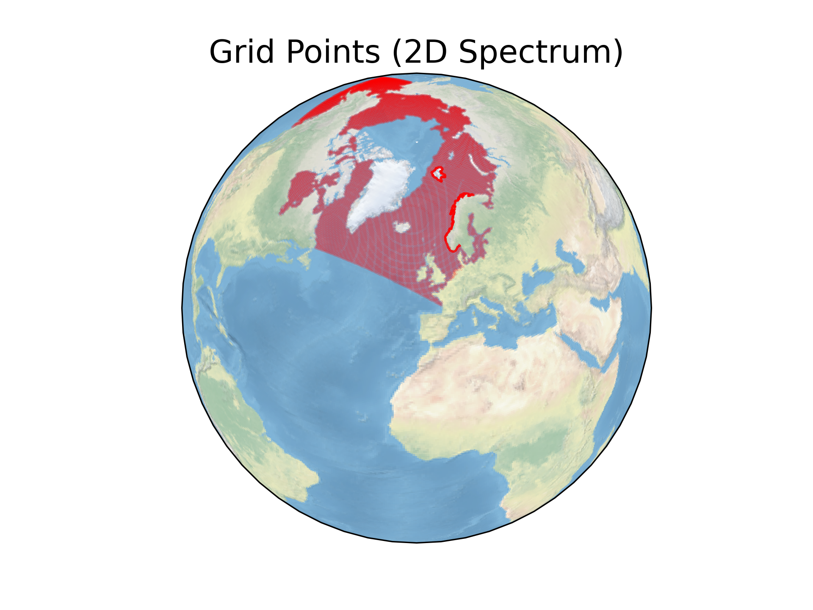
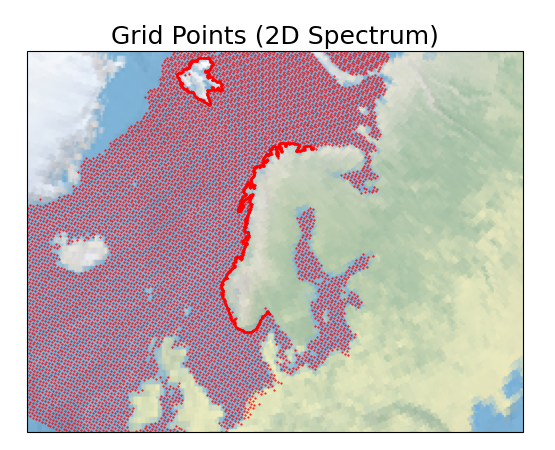
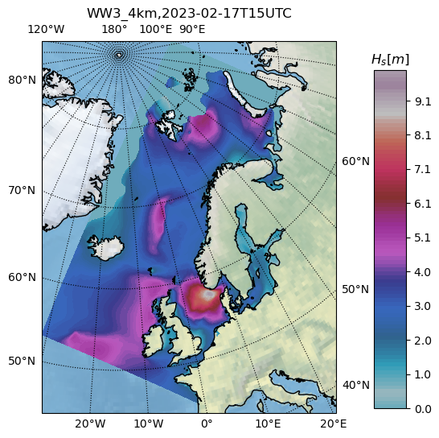
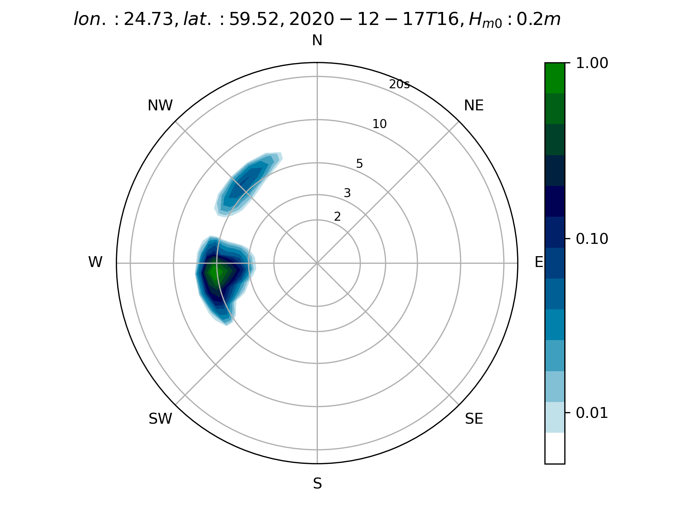

.. MET_waves documentation master file, created by
   sphinx-quickstart on Sun Nov 14 22:37:36 2021.
   You can adapt this file completely to your liking, but it should at least
   contain the root `toctree` directive.

Welcome to MET_waves's documentation!
=====================================
Tools for data analysis and visualization of MET Norway (https://www.met.no/) wave datasets (e.g., NORA3, WAM4).

Installing **MET_waves**
=============================================
1. Install anaconda3 or miniconda3
2. Clone MET_waves:

.. code-block:: bash

   $ git clone https://github.com/KonstantinChri/MET_waves.git
   $ cd MET_waves/

3. Create the environment with the required dependencies and install MET_waves:

.. code-block:: bash

  $ conda config --add channels conda-forge
  $ conda env create -f environment.yml
  $ conda activate MET_waves
  $ pip install -e .

Examples
=============================================

The package is under preparation. Some examples are given below:

 Plot all grid points that spectrum is available in NORA3/WAM4/WW3 datasets (https://thredds.met.no)::

   # example for NORA3:
   from MET_waves import plot_grid_spec_points
   url = 'https://thredds.met.no/thredds/dodsC/windsurfer/mywavewam3km_spectra/2020/12/SPC2020123100.nc'
   plot_grid_spec_points(url,s=0.01,color='red')

.. code-block:: rst

Plot panarctic map using NORA3 data (use method='mean' to average over time or method='timestep' to get each timestep)::

   from MET_waves import plot_panarctic_map
   plot_panarctic_map(start_time='2020-11-11T14', end_time='2020-11-11T15',
                      product='NORA3', variable='hs', method='timestep')

.. code-block:: rst

.. image:: hs_nora3.png
  :width: 400

Plot time series of a NORA3 grid point (and write data to .csv if write_csv=True)::

   from MET_waves import plot_timeseries
   plot_timeseries(start_time='2007-11-08T12', end_time='2007-11-10T23',
                   lon=3.20, lat=56.53, product='NORA3',
                   variable='hs', write_csv=True, ts_obs=None)
.. code-block:: rst

.. image:: hs_NORA3_ts.png
  :width: 400

Since the program uses directly thredds.met.no to access the data, it can take some time to plot/extract very long time series.
For long time series, please use the following function that extracts times series of the nearest gird point (lon,lat) from a wave product and saves it in a netcdf format::

   from MET_waves import extract_ts_point
   extract_ts_point(start_date ='2019-01-01',
                    end_date= '2019-01-31',
                    variable=['hs','tp','hs_swell','tp_swell', 'ff'],
                    lon = 5, lat = 60,
                    product='NORA3')
.. code-block:: rst

Plot 2D spectra of a NORA3(product='SPEC_NORA3')/WW3(product='SPEC_WW3') grid point::

   from MET_waves import plot_2D_spectra
   plot_2D_spectra(start_time='2007-11-08T23', end_time='2007-11-10T23',
                   lon=3.20, lat=56.53, product='SPEC_NORA3')
.. code-block:: rst

.. image:: spec_nora3.png
  :width: 400

Plot WW3_4km forecast::

   from MET_waves import plot_WW3_forecast
   plot_MET_forecast('https://thredds.met.no/thredds/dodsC/ww3_4km_latest_files/ww3_20230217T06Z.nc')
.. code-block:: rst

Plot SWAN 2D spectrum::

   from MET_waves import plot_swan_spec2D
   plot_swan_spec2D(start_time='2020-12-17T16', end_time='2020-12-17T17',infile='SWAN_spec.nc', site=0)
.. code-block:: rst

Plot TOPAZ data (use method='mean' to average over time or method='timestep' to get each timestep)::

   from MET_waves import plot_topaz
   plot_topaz(start_time='1999-02-02',end_time='1999-02-03',
              variable='fice',method = 'timestep',save_data =True)

.. code-block:: rst

.. image:: fice_topaz.png
  :width: 400

.. toctree::
   :maxdepth: 2
   :caption: Contents:
